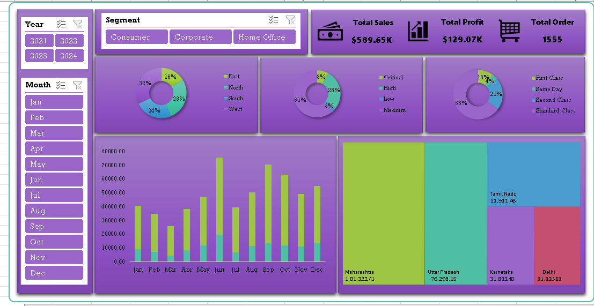

# Super Store Data Analytics Dashboard Excel

## 📊 Project Overview

This project is an interactive Excel Data Analytics Dashboard
created to analyze Super Store business performance.

The dashboard provides insights into sales, profit, orders,
segments, regions, shipping modes, monthly performance,
and state-wise sales.

## 📷 Dashboard Preview

## 📈 Key Performance Indicators

- Total Sales
- Total Profit
- Total Orders

## 🔍 Dashboard Analysis

The dashboard provides analysis of:

- Sales by Region
- Sales by Segment
- Sales by Ship Mode
- Sales by Priority
- Monthly Sales Performance
- State-wise Sales
- Year-wise Performance
- Month-wise Performance

## 🎛️ Interactive Filters

Users can filter the dashboard by:

- Year
- Month
- Segment

## 🛠️ Tools Used

- Microsoft Excel
- Excel Charts
- Pivot Tables
- Pivot Charts
- Data Analysis
- Data Visualization

🎯 Objective

The objective of this project is to transform raw Super Store
data into an interactive dashboard that helps users understand
sales and profitability patterns and explore business performance
using different filters.

👨‍💻 Project Author

Shailesh Panchal

## 📂 Project Structure

Super-Store-Data-Analytics-Dashboard/
│
├── README.md
│
├── Dashboard/
│   └── Super-Store-Data-Analytics-Dashboard.xlsx
│
├── Dataset/
│   └── Super-Store-Dataset.xlsx
│
└── Screenshots/
    └── Super-Store-Dashboard.png
